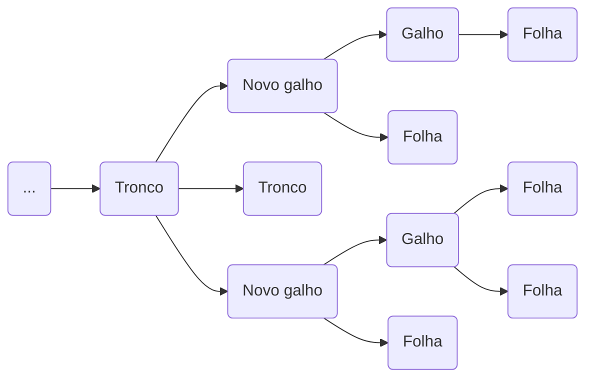

# A Ideia da ***Branch***

Se pensarmos no git como uma linha temporal, a  ***branch*** seria uma divergência dessa linha do tempo. Então o que antes era uma única linha reta - um graveto, a linha temporal master - agora se torna uma árvore, com possibilidade de ter inúmeros galhos. Por isso, ***branch*** é a palavra em inglês para significar galho.



---

Podemos pensar ainda sobre a "***branch***" por duas perspectivas, a do seu **conceito** abstrato e a da sua implementação.

Sua forma abstrata já explicamos, a ***branch*** representa a possibilidade de criar uma linha do tempo paralela, que pode divergir da linha do tempo principal ou de outros galhos. **Na sua implementação, a ***branch*** não passa de um ponteiro que aponta para um commit**.

Muito parecido com uma tag - como já discutido anteriormente. A diferença é que a tag aponta somente para um commit especifico, enquanto a ***branch*** automaticamente aponta para o commit mais recente da ***branch*** conceitual que ela representa.

```mermaid
graph LR


```

