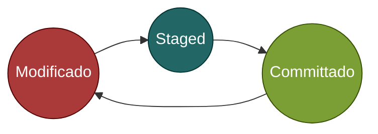
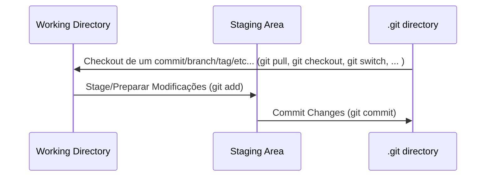

# Estados de Um Arquivo e Mais Sobre Qualquer Repositório

## Os Estados de um Arquivo

Podemos descrever os arquivos num repositório em duas categorias. Eles podem estar **rastreados** (em inglês *tracked*) ou **não rastreados** (*untracked*).

Um arquivo é considerado rastreado quando o git está o monitorando.
Já um arquivo *untracked* é um arquivo que o git não lidará.

Quando criamos um novo arquivo, o git mal sabe de sua existência, ele não está sendo rastreado. Para rastreá-lo basta usar o comando `git add [nome do arquivo]`.

### O Arquivo Rastreado

Por sua vez, um arquivo rastreado contêm três estados possíveis:

###### Estados de um Arquivo Rastreado

Um arquivo rastreado pode estar **modificado** (*modified*), ***staged*** ("No palco") ou **"commitado"** (*committed*).

***Committed*** significa que o arquivo está do mesmo jeito do que está armazenado no banco de dados do git.

**Modificado** implica que o seu arquivo foi alterado e **não se encontra do mesmo jeito que estava no último commit** ou da última vez que esteve no estado ***staged***.

**Staged** significa que você marcou um arquivo modificado para mandá-lo ao próximo commit.

## Localidades de um Projeto Git

Um projeto git possui três **localidades**:

###### Localidades de um Projeto Git

O ***working directory***, a ***staging area*** e o ***.git directory***.

O ***working directory*** nada mais é do que o diretório do teu projeto onde você está trabalhando. Ele representa o **"presente" do seu projeto**, ele pode ser igual ao último commit, pode ter modificações ou pode ter arquivos novos...

A ***staging area***, muitas vezes referida como *index*, é um arquivo que representa uma lista que contém informações sobre o que irá para o próximo commit. O arquivo pode ser encontrado em `.git/index`. Pode pensar nela como o **"futuro" do seu repositório**.

>[!TIP]
> Em português, *staging area* pode ser traduzido como **área de preparação**. No correio, a área de preparação é onde as cartas são preparadas para serem enviadas.

>[!TIP]
> Num restaurante, como o de Wanderlau, a *staging area* seria uma mesa onde os pratos são preparados antes de serem enviados para os clientes.

O ***.git directory*** é onde está armazenado os metadados e o banco de dados do git, lá é guardado os seus dados de forma compactada. Considerando que sempre começamos a atualizar nosso projeto a partir dos dados contidos no ***.git directory***, podemos dizer que ele representa o **"passado"**.

## Recomendado

- [Index](../readme.md)
- [Parte 2 - Criando um Repositório Remoto no Github](Parte%202%20-%20Criando%20um%20Reposit%C3%B3rio%20Remoto%20no%20Github.md)
