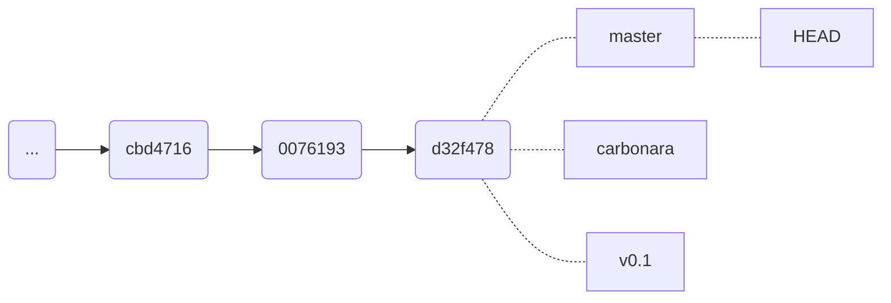
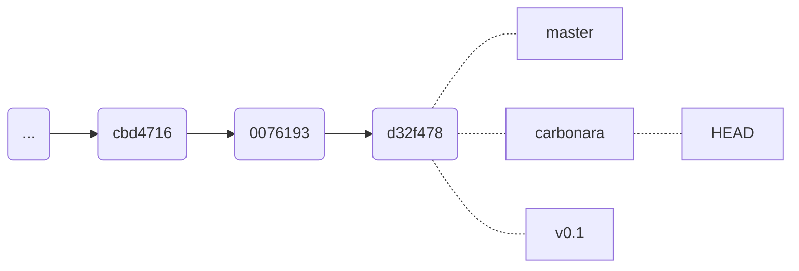
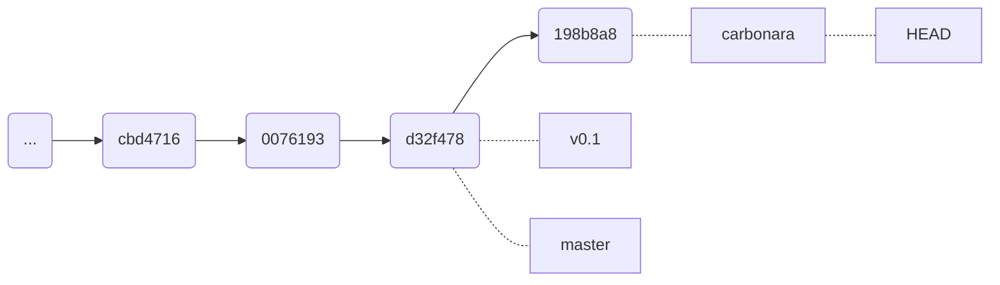
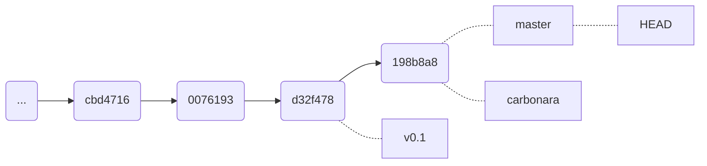

# Parte 4 - Branches

## Recapitulação do último capítulo

No último capítulo, você finalmente começou a criar as receitas para impressionar o **Sr. Pierter Dussuí**. 

No entanto, ao nos depararmos com um problema, aprendemos a como usar o comando `git restore` para restaurar um arquivo ao seu estado anterior, aprendemos também a funcionalidade do `git diff` e como usar as ***tags*** para marcar pontos importantes no histórico do repositório.

## Introdução

Bom, Wanderlau. Teu amigo, o Manoel - aquele que trabalha na ABIN - teve acesso a informações confidencialíssimas, mais quentes que um molho que acabou de ferver.

Falando em molho, você gosta de massas? As informações dizem que **o Sr. Dussuí é um grande apreciador de massas**, especificamente de ***Spaghetti alla Carbonara***. Você sabe fazer essa receita?

Não conhece? Não se preocupe, Wanderlau, aprendi a fazer essa receita com uma amiga seguramente italiana. Não confia em mim? Bom, me sinto meio ofendido, mas tudo bem.

Vamos fazer o seguinte, então. Vamos criar uma ***branch*** para desenvolver a receita, se você gostar, podemos mesclar a ***branch*** com a *master*, se não, é só deletar a ***branch***, pode ser? "Cortar o galho" que não te agradou, *sacastes*?

## Criando uma Branch

>[!TIP]
> Se quiser saber mais sobre o conceito de ***branch***, veja [A Ideia da ***Branch***](Outros/A%20Ideia%20da%20Branch.md).

É muito simples criar uma ***branch***. Vamos criar uma ***branch*** chamada `carbonara`.

```bash
git branch carbonara
```

Bacana, vamos ver mais ou menos como está nosso histórico do git com o comando `git log`.

```bash
git log --oneline --graph -n 3
# A opção '--oneline' mostra o histórico de commits de forma resumida.
# A opção '--graph' mostra o histórico de commits de forma gráfica.
# A opção '-n 3' mostra somente os três últimos commits.
```

Isto deve mostrar algo mais ou menos assim:

```bash
* d32f478 (HEAD -> master, tag: v0.1, github/master, carbonara) Criada a primeira receita! Criada a parte 3 do tutorial!
* 0076193 Blablabla!
* cbd4716 etc...
* ...
```

###### Output

Caramba, o que tudo isso significa? Bom, vamos lá. Na primeira linha do output temos o **hash** do último commit (um tipo de identificador), entre parênteses temos vários ponteiros que estão apontando para o tal commit: **HEAD**, **master**, **tag: v0.1**, **github/master** e **carbonara**.

O **HEAD** é um ponteiro especial que aponta para a referência que está atualmente em uso. No caso, o **HEAD** está apontando para a *master*,
Isso quer dizer que toda nosso *working directory* está baseada na ***master***, que está apontando para o commit `d32f478`.

Além disso, repare meu caro cozinheiro, que criamos a ***branch*** `carbonara` mas a **HEAD** ainda está apontando para a *master*, como ilustrado no diagrama abaixo. Isso quer dizer que estamos trabalhando na *master* e não na `carbonara`.

Ou seja, quando criamos a ***branch***, não automaticamente mudamos para ela.



###### Diagrama dos Commits

Podemos ainda confirmar isso com o comando `git branch`. Que nos mostra as ***branches*** existentes e qual a ***branch*** que estamos atualmente. A ***branch*** que estamos atualmente é marcada com um asterisco (* master).

Para mudar para a ***branch*** `carbonara` basta usar o comando `git checkout` ou `git switch`.

```bash
git checkout carbonara # ou
git switch carbonara
Switched to branch 'carbonara'
```

Agora, como ilustrado no próximo diagrama, a **HEAD** está apontando para a `carbonara`.



###### Diagrama dos Commits após mudar para a branch `carbonara`

Outra coisa que é interessante notar é que a tag 'v0.1' é também um ponteiro. Nos podemos fazer a HEAD apontar para a tag e até mesmo para um commit específico!

## Merge Fast-Forward

Agora que estamos na ***branch*** `carbonara`, tomei a liberdade de ter criado a receita do *Spaghetti alla Carbonara* para você!

```markdown
# Macarrão à Carbonara

Ingredientes:

200g de macarrão tipo spaghetti ou bucatini: Opte por marcas de grano duro para garantir textura e sabor.
150g de guanciale: Se não encontrar, utilize bacon defumado de boa qualidade em cubos.
[...]
```

###### "Principal - Macarrão à carbonara.md"

Viu só? Eu falei que essa receita era excelente!

Após termos adicionado a receita na staging area e ter feito o commit, observa-se que o `git log` será assim:



Não ficou ruim, né? Como gostou vamos mesclar a `carbonara` com a `master``.

```bash
git checkout master # Primeiro vamos mudar para a master
git merge carbonara
```

Esse é um merge muito simples, a master deverá somente avançar para o commit mais atual, como se avançasse no tempo. Um simples "fast-forward". Como esse é o merge mais simples, onde não há divergências entre as branches, não devera haver nenhum problema.

vamos deletar a `carbonara` agora, já que não precisamos mais dela. `git branch -d carbonara`.



Boa, Wanderlau! Acho que agora só falta a sobremesa, já está pensando em algo?

Não esqueça de empurrar as alterações para o repositório remoto!

## Recomendado

* [**Índice**](readme.md)
* [**Parte 3 - Primeira Receita, *git diff*, *git restore* e *Tags***](Parte%203.md)
* [**Parte 5 - Branches Remotas e Tracking Branches**](Parte%205.md)

