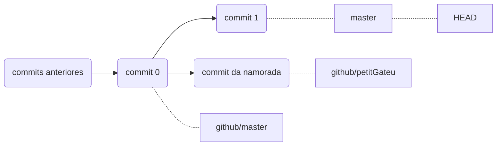

# Resolução de Conflitos

## Sobremesa - A Receita Final

Nossa, o título ficou meio dramático, mas é isso mesmo. Para Pieter Dussuí só falta a sobremesa...

Está me falando que teve a ideia perfeita?!? Fazer um especialíssimo *Petit Gateau*?

Jogada de mestre genial, Wanderlau! A viagem gastronômica perfeita. Decolamos de uma salada tropical  - remetendo ao Brasil, então damos um pula na Itália, com um autêntico *Spaghetti alla Carbonara*. E por fim, trazemos Dussuí de volta a sua terra natal, com um ***Petit Gateau***.

Vamos lá, então, para a receita final!

## Introdução

>  Wanderlau então começou a escrever a receita, mas para sua surpresa, nesse meio tempo, sua namorada enviou para o repositório uma receita especial de ***Petit Gateau***.

Está me dizendo que você foi perguntar pra ela se lembrava da receita de ***Petit Gateau*** que vocês fizeram juntos no último aniversário dela? E de repente, ela já colocou a receita no repositório?

Nossa, Wanderlau, como sua namorada é prestativa. E agora? Está me dizendo que há alguns pontos na sua receita que você gostaria de manter, mas também gostaria de adicionar alguns ingredientes da receita dela?

Mas essa é a situação perfeita para um *merge*!

## Fazendo o Merge

Vejamos a situação. Nós temos nossa receita na branch local `master` e a receita da sua namorada na branch `petitGateu` no `github`. Se dermos um `git status` veremos que teoricamente estamos "atualizados" com o repositório remoto pois ainda não demos `git fetch`.

Vamos primeiro commitar o que temos agora e em seguida fazer um `git fetch` para atualizarmos as informações do repositório remoto.

Pronto. Se dermos um `git log  --oneline --graph --all` veremos que a situação está mais ou menos assim:



###### Situação atual

- O **`commit 0`** é o commit que fizemos antes de você começar a escrever a receita. Como não empurramos o `commit 1` para o repositório remoto, esse é o que `github/master` aponta.
- O **`commit 1`** é o commit que fizemos agora, com a receita a sua versão da receita. Não está no repositório remoto.
- O **`commit 2`** é o commit que sua namorada fez, com a versão dela da receita. É representada pela branch `github/petitGateu`.

Se quisermos ver o conteúdo da receita da sua namorada, podemos usar `git show github/petitGateau:versãoDaSuaNamorada.md`.

Para se ver a diferença entre as receitas, pode se usar `git diff master:<arquivo> github/petitGateau:<arquivoDaSuaNamorada>`.

Legal, vamos fazer o merge com `git merge <branch-da-namorada>`. Ops! Conflito, e agora?

## Resolvendo Conflitos

```bas
Auto-merging Receitas/Sobremesa - Petit Gateau.md
CONFLICT (add/add): Merge conflict in Receitas/Sobremesa - Petit Gateau.md
Automatic merge failed; fix conflicts and then commit the result.
```
###### Mensagem de erro no meu caso

Não tema, Wanderlau. Conflitos ocorrem o tempo todo, a melhor forma de resolvê-los é com consciência, qualquer tipo de conflito!

Agora estamos no estado de ***merging***, se ficarmos horrorizados podemos usar `git merge --abort` para cancelar o merge e voltar para o estado anterior. ~~Se não funcionar, ligue para o 0800.~~

Podemos ver os arquivos que não foram mesclados, ou seja, que estão em conflito, com `git status`. Vamos ver como nossa receita está:

```markdown
<<<<<<< HEAD
### Ingredientes:

- 200g de chocolate ao leite
=======
# Petit Gateau

## Ingredientes:

- 200g de chocolate amargo
>>>>>>> github/petitGateau
- 1/2 xícara (chá) de manteiga
- 1/2 xícara (chá) de açúcar
- 2 ovos
- 2 gemas
- 1/4 xícara (chá) de farinha de trigo
<<<<<<< HEAD
- 1 colher (sopa) de café solúvel
- Manteiga e farinha de trigo para untar e polvilhar

[...]
=======
- 4 morangos
- Manteiga e farinha de trigo para untar e polvilhar

[...]
>>>>>>> github/petitGateau
```

Olha só, há linhas novas na nossa receita! Não acho que foi sua namorada quem escreveu "======", ">>>>>>>" e "<<<<<<<".

O que está entre `<<<<<<< HEAD` e `=======` é o que está na nossa receita, mais especificamente o que está no nosso `HEAD`. O que está entre `=======` e `>>>>>>> github/petitGateau` é o que está na receita da sua namorada em `github/petitGateau`. Repare que o `=======` é simplesmente uma linha que separa as duas versões do arquivo. Para concertamos o conflito basta modificar o arquivo (pode-se editar manualmente) para que fique como queremos.

Está me falando que gostou da ideia dela de usar morangos? E que morangos combina com chocolate amargo? Então vamos manter o chocolate amargo e adicionar os morangos. Vai continuar com o café solúvel?

Interessante, então deve-se usar chocolate meio amargo senão o sabor do café solúvel vai se sobressair?

```markdown
# Petit Gateau

## Ingredientes

- 200g de chocolate meio amargo
- 1/2 xícara (chá) de manteiga
- 1/2 xícara (chá) de açúcar
- 2 ovos
- 2 gemas
- 1/4 xícara (chá) de farinha de trigo
- 1 colher (sopa) de café solúvel
- Manteiga e farinha de trigo para untar e polvilhar
- 4 morangos

[...]
```

###### Eis a receita final

Só basta salvarmos, adicionar o arquivo e commitar. A última receita está pronta.